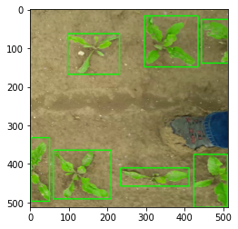
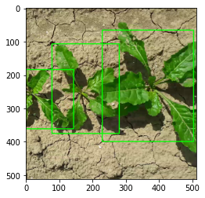
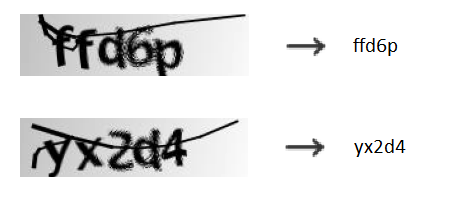

# Data_science

Le répertoire ci dessus contient des projets data science utilisant des techniques de machine learning et de deep learning

<h3> yolo.ipyn </h3>

   Sujet : Computer vision, localisation d'objets dans image  
   Librairies utilisées : tensorflow2, scikit-Learn, openCv, pillow
   
      Techniques utilisées : algorithme yolo v2 (algorithme de localisation d'objets), transfert learning, Kmeans.
  
Exemples de localisations:
  
     

<h3> transformer.ipynb </h3>

   Sujet : Projet NLP data science traduction de langue en utilisant l'architecture "transformers".
   Librairies utilisées : tensorflow2  
   
      Techniques utilisées : Modèles type transformers
  
Architecture implémentée :
  
   

<h3> translation.ipyn </h3>

   Sujet : Projet NLP data science traduction de langue.  
   Librairies utilisées : tensorflow2, numpy  
   
      Techniques utilisées : Modèles seq2seq à cellules LSTM avec mécanisme d'attention.
  
Architecture implémentée :

<h3> ocr.ipyn </h3>

   Sujet : Computer vision, Reconnaissance optique de caractères.  
   Librairies utilisées : keras, numpy, matplotlib
   
       Techniques utilisées : réseaux convolutifs(CNN) et réseaux LSTM.  
  

<h3> predict_price.ipyn </h3>

   Sujet : Prédiction d'une variable "prix" à partir de variables numériques et catégorielles.  
   Librairies utilisées : sklearn, pandas, keras, xgboost, matplotlib.
   
      Techniques utilisées : Algorithmes de machine learning (regression linéaire, gradient boosting, etc...) et réseau de neurones simple.    
 
<h3> text_M_2.ipyn </h3>
   
   NLP -> Classification (catégorisation) de texte en utilisant des réseaux réccurents (LSTM).   
  
